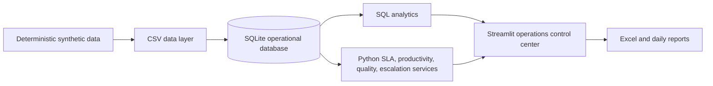

# OpsPulse

## Project Overview
OpsPulse is a portfolio project that simulates a fictional delivery-partner support operations control center. It uses synthetic operational data to demonstrate case management, SLA monitoring, productivity tracking, quality review, escalation handling, stakeholder communication, and process improvement.

This is not an Amazon system and does not represent Amazon employees, customers, operations, or internal procedures.

## Business Problem
Operations teams need a reliable daily view of work intake, SLA risk, SOP adherence, resolution throughput, quality exceptions, escalations, and stakeholder follow-up. OpsPulse turns those operational records into an actionable control center.

## Objectives
- Monitor operational KPIs from underlying records.
- Identify breached and at-risk cases.
- Apply controlled case workflow transitions.
- Measure productivity, quality, and SOP compliance.
- Track escalation reasons and stakeholder response.
- Generate Excel-ready operational reporting.

## Features
- 1,200 deterministic simulated cases across 30 days.
- 100 fictional delivery partners and 20 fictional associates.
- SQLite database with normalized operational tables and indexes.
- Streamlit pages for dashboard, case management, SLA monitoring, productivity, quality, escalations, SOPs, stakeholder responses, reports, and improvements.
- Dynamic alerts, filters, case search, update validation, SQL analysis queries, and Excel export.

## Architecture
`Data generator -> CSV files -> SQLite database -> Python services -> Streamlit -> Reports`



## Portfolio Screenshots
The Streamlit application is designed to be captured at these portfolio checkpoints: Dashboard KPI view, Case Management update workflow, SLA Monitor queue, and Reports Excel export. Run the app locally with `streamlit run app/app.py`, open the corresponding pages, and save screenshots into `screenshots/` before publishing the portfolio repository.

## Technology Stack
Python 3.12+ is the target runtime. The project uses Pandas and NumPy for deterministic data and analytics, SQLite for a zero-setup local database, Streamlit for the application, Plotly for charts, openpyxl for Excel export, and pytest for business-rule tests.

## Database Schema
The schema contains `associates`, `delivery_partners`, `cases`, `case_updates`, `escalations`, `quality_reviews`, `stakeholder_responses`, and `daily_operations`. Search and operational filters are supported by indexes on partner, associate, date, status, priority, and SLA status.

## SLA Logic
Priority targets are LOW = 60 minutes, MEDIUM = 30 minutes, and HIGH = 15 minutes. The synthetic dataset uses a fixed reporting snapshot of 01 Oct 2026 23:59. Resolved cases use resolution time; unresolved simulated cases are generated in the current reporting window and use the fixed snapshot rather than the machine clock. Remaining time below 0 is `BREACHED`; 0 through 10 minutes is `AT RISK`; above 10 minutes is `WITHIN SLA`.

### SLA Methodology
Historical resolved cases use `received_time` to `resolution_time`. Unresolved cases use `REPORTING_AS_OF`; no live current-time calculation is used for historical simulation. SLA compliance is calculated as cases within SLA divided by all cases eligible for SLA measurement.

### Repeated Issue Rule
A repeated issue is identified when the same delivery partner experiences the same issue type at least twice within a 7-day period. Cases outside that window are not flagged as repeated issues.

### Escalation Logic
Escalations are generated only for operational exceptions: SLA breach, high-priority unresolved work, repeated issue within 7 days when unresolved or breached, explicit manager intervention, or SOP resolution failure. High customer impact escalates only when combined with another operational risk such as a breach, high priority, repeated issue, manager intervention, or SOP failure. All records and metrics are simulated portfolio data.

## SOP Workflow
The fictional workflow is: New Case -> Identify Issue -> Check Priority -> Follow SOP -> Resolved? -> Quality Check -> Update Tracker -> Close Case. SOP examples are clearly fictional and are not copied from any company procedure.

## How to Run
```text
python -m venv .venv
.venv\Scripts\activate
pip install -r requirements.txt
python scripts/generate_data.py
python scripts/load_database.py
streamlit run app/app.py
```

Or run `run_app.bat` on Windows after installing dependencies.

## Sample Operational Metrics
All metrics shown by OpsPulse are **simulated project data** generated from a fixed seed. They are not employment metrics and do not describe real operations.

## How This Project Relates to an Operations Associate Role
This portfolio project demonstrates SOP adherence, SLA monitoring, productivity measurement, quality monitoring, escalation handling, operational tracking, stakeholder communication, issue identification, process improvement, Microsoft Office / Excel experience, SQL, and analytical capability.

### Interview Explanation
“OpsPulse is a fictional operations-control platform built with synthetic delivery-partner support data. I designed it around the daily operating rhythm: intake, priority assessment, SOP execution, SLA risk, resolution quality, escalation, stakeholder follow-up, and reporting. The important design choice is that dashboard KPIs are calculated from normalized case, escalation, and stakeholder records rather than hard-coded. It demonstrates how I would structure operational monitoring, identify exceptions, and turn recurring patterns into process-improvement ideas without presenting simulated data as real work experience.”

## Limitations
- Data is synthetic and fictional.
- SOPs are fictional examples.
- Metrics are not from Amazon.
- The project does not represent Amazon's internal systems or processes.
- SQLite is used for easy local demonstration; MySQL can be added through the configuration boundary.

## Future Improvements
Automated email alerts, cloud database support, role-based access, real-time event streaming, and predictive workload forecasting.

## Resume Honesty
Use: “Built an operations monitoring system using 1,000+ simulated delivery-partner cases.” Do not describe the dataset as actual employment experience.
